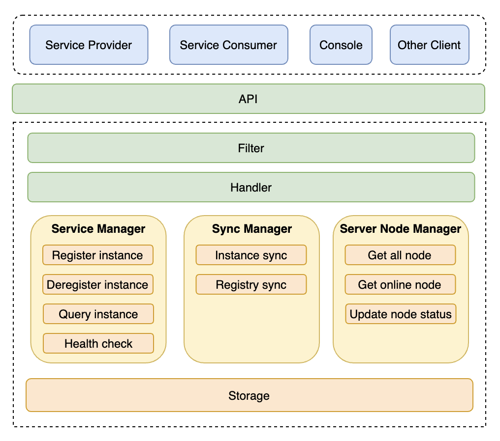
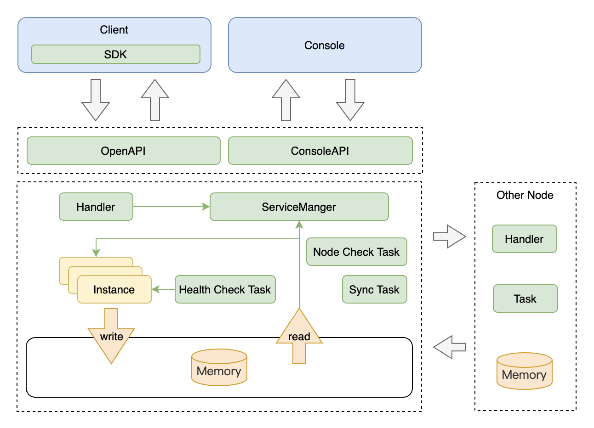

# Architecture

## Structure

The basic structure as follow:

Components:

* Clients:
  * Service Provider: The application that provides a callable service
  * Service Consumer: The application that initiates a call to a service
  * Console: A visual console for viewing service information and cluster information

* Filter: Intercepts request, outputs log, and forwards request
* Handler: Provides HTTP routing processing, receives HTTP request, processes request, invokes service management, synchronizes management, etc
* Service Manager: Provides the functions of registering, deregistering, querying, and modifying service instances. Updated the instance heartbeat time to implement service health check
* Sync Manager: Manages service instance synchronization and synchronizes tasks
* Server Node Manager: Manages cluster nodes, maintains cluster node information, and checks node health
* Storage: Storage for registry information

## Service Model

The console is a visual console for viewing service information and cluster information, it gets information through ConsoleAPI.

After clients integrates with the SDK，clients and registry server interact through OpenAPI, and client send request with service instance information to server. Those clients usually are microservice providers or consumers.

The route handler of the registry server is responsible for processing HTTP routes. After receiving the registered instance request, it first reads the request data and verifies the validity of parameters. After passing the verification, the service management will first create the service object, and then fill the instance information into the service object, and then write it into the memory. If the service object already exists, the instance information is directly populated and then written to memory. After the service instance information is saved, active synchronization is triggered. The server synchronizes the newly added service instance data to other nodes and synchronizes the registry to other nodes periodically to ensure data consistency.

After the server receives the query instance request, the routing handler receives and processes it and invokes the service management, which reads the service instance information from the memory and returns it to the client.

To ensure the normal running of all nodes in the cluster, a node health status check task is provided on the server. The task periodically checks whether other nodes in the cluster are running properly and then updates the node information.
