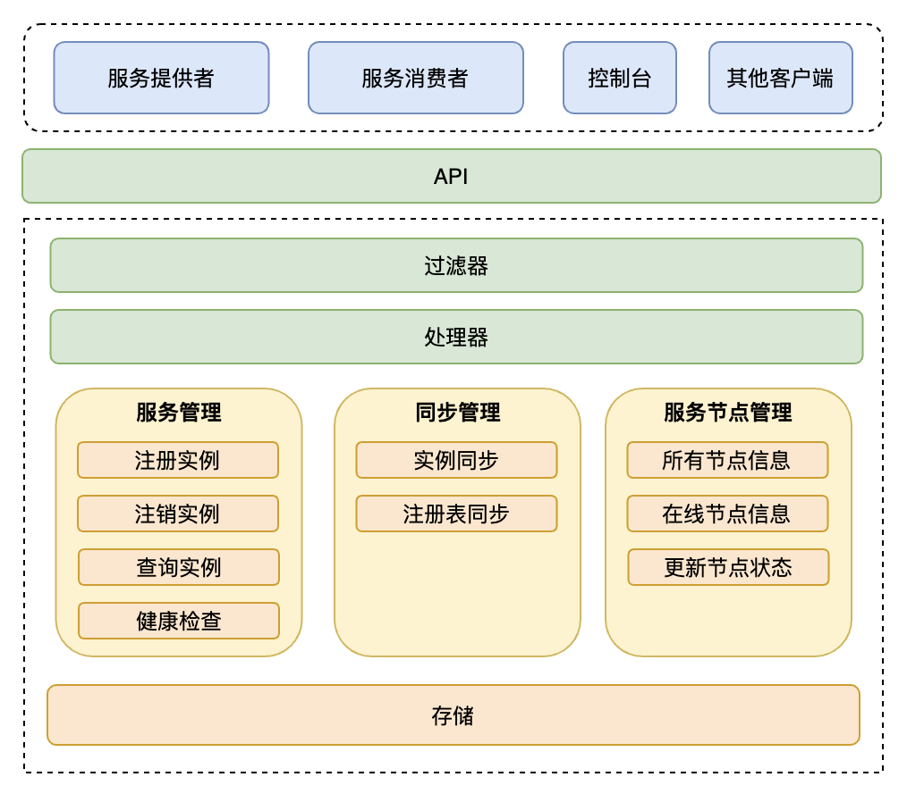
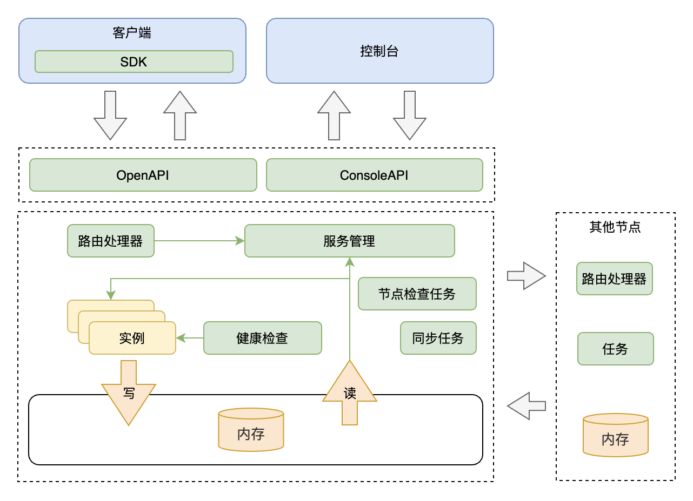

# 架构

## 结构

基本结构如下：

组件介绍:

* 客户端:
  * 服务提供者：提供可调用服务的应用程序
  * 服务消费者：发起对某个服务调用的应用程序
  * 控制台：用于查看服务信息和集群信息的可视化控制台

* 过滤器：拦截请求，做日志输出、请求转发等功能
* 处理器：提供 HTTP 路由处理，接收 HTTP 请求，处理请求，调用服务管理，同步管理等
* 服务管理：提供服务实例注册、注销、查询、修改等功能。更新实例心跳时间，实现服务健康检查
* 同步管理：管理服务实例同步，同步任务
* 节点管理：管理集群节点，维护集群节点信息，节点健康检测
* 存储：用于注册表信息的存储

## 服务模型

控制台是一个 Web 端应用，它可以非常方便地查看服务信息和集群信息，它通过 ConsoleAPI 和服务端交互。

客户端集成 SDK 后，客户端和注册中心服务端通过 OpenAPI 交互，客户端携带服务实例信息向服务端发送请求。通常这些客户端是微服务提供者或者消费者。

注册中心服务端的路由处理器负责处理 HTTP 路由，收到注册实例请求后先读取请求数据并对参数做合法性校验。校验通过后交给服务管理来处理，服务管理会先创建服务对象，然后把实例信息填充到服务对象中，再将其写入内存中；如果服务对象已经存在就直接填充实例信息，然后写入内存。服务实例信息保存后，会触发主动同步，服务端把新增的服务实例数据同步给其他节点，同时还有定时同步任务将注册表全部同步给其他节点，通过这两种同步方式来保证数据的最终一致性。

服务端收到查询实例请求后，路由处理器接收处理，调用服务管理，由服务管理从内存中读取服务实例信息然后返回给客户端。

为了保证集群所有节点正常工作，服务端有节点健康状态定时检查任务，任务会定时的检查集群中其他节点是否正常，然后更新对应的节点信息。

